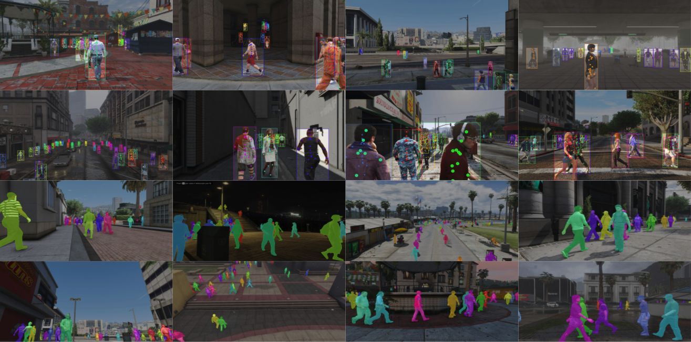

# MOTSynth Baselines
This repository provides download instructions and helper code for the [MOTSynth dataset](https://arxiv.org/abs/2108.09518), as well as baseline implementations for object detection, segmentation and tracking.

Check out our:
- [ICCV 2021 paper](https://openaccess.thecvf.com/content/ICCV2021/html/Fabbri_MOTSynth_How_Can_Synthetic_Data_Help_Pedestrian_Detection_and_Tracking_ICCV_2021_paper.html)
- [5 min. video](https://www.youtube.com/watch?v=dc_Z1iCceL4)
- [Dataset page](https://motchallenge.net/data/MOTSynth-MOT-CVPR22/) 
- [Project Page](https://aimagelab.ing.unimore.it/imagelab/page.asp?IdPage=42)

> 


# Installation:
See [docs/INSTALL.md](docs/INSTALL.md)

# Dataset Download and Preparation:
See [docs/DATA_PREPARATION.md](docs/DATA_PREPARATION.md)

# Object Detection (and Instance Segmentation):
We adapt [torchvision's detection reference code](https://github.com/pytorch/vision/tree/main/references/detection) to train [Mask R-CNN](https://arxiv.org/abs/1703.06870) on MOTSynth. To train Mask R-CNN with a ResNet50 with FPN backbone, you can run the following:
```
NUM_GPUS=3
PORT=1234
python -m torch.distributed.launch --nproc_per_node=$NUM_GPUS --use_env  --master_port=$PORT tools/train_detector.py\
    --model maskrcnn_resnet50_fpn\
    --batch-size 5 --world-size $NUM_GPUS --trainable-backbone-layers 1  --backbone resnet50 --train-dataset train --epochs 10
```
If you use a different number of GPUs (`$NUM_GPUS`), please adapt your learning rate or modify your batch size so that the overall batch size stays at 15 (3 GPUs with 5 images per GPU).

Our trained model can be downloaded [here](https://vision.in.tum.de/webshare/u/brasoand/motsynth/maskrcnn_resnet50_fpn_epoch_10.pth)

# Multi-Object Tracking:
We use our Mask R-CNN model trained on MOTSynth to test [Tracktor](https://arxiv.org/abs/1903.05625) for tracking on MOT17.

To produce results for MOT17 train, you can run the following:
```
python tools/test_tracktor.py
```
This model should yield the following results:
TODO

# Multi-Object Tracking and Segmentation:
We provide a simple baseline for MOTS. We run Tracktor with our trained Mask R-CNN detector, and use Mask R-CNN's segmentation head to produce an segmentation mask for every output bounding box.

To evaluate this model on MOTS20, you can run the following:
```
python tools/test_tracktor.py  mots.do_mots=True mots.mots20_only=True
```
This model should yield the following results on MOT17 train:
```
          IDF1   IDP   IDR  Rcll  Prcn  GT  MT  PT  ML    FP    FN IDs    FM  MOTA  MOTP IDt IDa IDm
MOT17-02 35.2% 51.7% 26.7% 38.9% 75.4%  62   8  27  27  2361 11353  99   152 25.7% 0.251  28  78   8
MOT17-04 55.5% 65.9% 48.0% 63.2% 86.8%  83  29  33  21  4569 17524  93   245 53.3% 0.204  23  75   5
MOT17-05 62.2% 78.4% 51.6% 59.0% 89.6% 133  30  71  32   473  2834  41    90 51.6% 0.242  29  27  16
MOT17-09 47.4% 51.9% 43.6% 67.0% 79.8%  26  10  15   1   903  1757  51    69 49.1% 0.230  21  34   6
MOT17-10 42.1% 60.1% 32.4% 49.1% 91.1%  57  12  23  22   614  6534 146   326 43.2% 0.240  13 129   4
MOT17-11 57.7% 70.4% 48.9% 63.0% 90.7%  75  23  22  30   607  3491  31    43 56.2% 0.197   7  26   2
MOT17-13 39.9% 64.7% 28.8% 38.4% 86.2% 110  17  47  46   717  7168  88   151 31.5% 0.253  42  67  23
OVERALL  49.7% 63.7% 40.8% 54.9% 85.7% 546 129 238 179 10244 50661 549  1076 45.3% 0.220 163 436  64
```

# Person Re-Identification
We treat MOTSynth and MOT17 as ReID datasets by sampling 1 in 60 frames and treating each pedestrian as a unique identity. We use [torchreid](https://github.com/KaiyangZhou/deep-person-reid/tree/master/torchreid)'s amazing work to train our models.

You can train our baseline ReID model with a ResNet50, on MOTSynth (and evaluate it on MOT17 train) by running:
```
python tools/main_reid.py  --config-file configs/r50_fc512_motsynth_train.yaml 
```
The resulting checkpoint can be downloaded [here](https://vision.in.tum.de/webshare/u/brasoand/motsynth/resnet50_fc512_reid_epoch_19.pth) 


# Acknowledgements
This codebase is built on top of several great works. Our detection code is minimally modified from [torchvision's detection reference code](https://github.com/pytorch/vision/tree/main/references/detection). For MOT, we directly use [Tracktor's codebase](https://github.com/phil-bergmann/tracking_wo_bnw), and for ReID, we use the great [torchreid](https://github.com/KaiyangZhou/deep-person-reid/tree/master/torchreid) framework. [Orçun Cetintas](https://github.com/ocetintas/) also helped with the MOTS postprocesing code. We thank all the authors of these codebases for their amazing work.

# Citation:
If you find MOTSynth useful in your research, please cite our publication:
```
    @inproceedings{fabbri21iccv,
            title     = {MOTSynth: How Can Synthetic Data Help Pedestrian Detection and Tracking?},
            author    = {Matteo Fabbri and Guillem Bras{\'o} and Gianluca Maugeri and Aljo{\v{s}}a O{\v{s}}ep and Riccardo Gasparini and Orcun Cetintas and Simone Calderara and Laura Leal-Taix{\'e} and Rita Cucchiara},
            booktitle = {International Conference on Computer Vision (ICCV)},
            year      = {2021}
    }
```